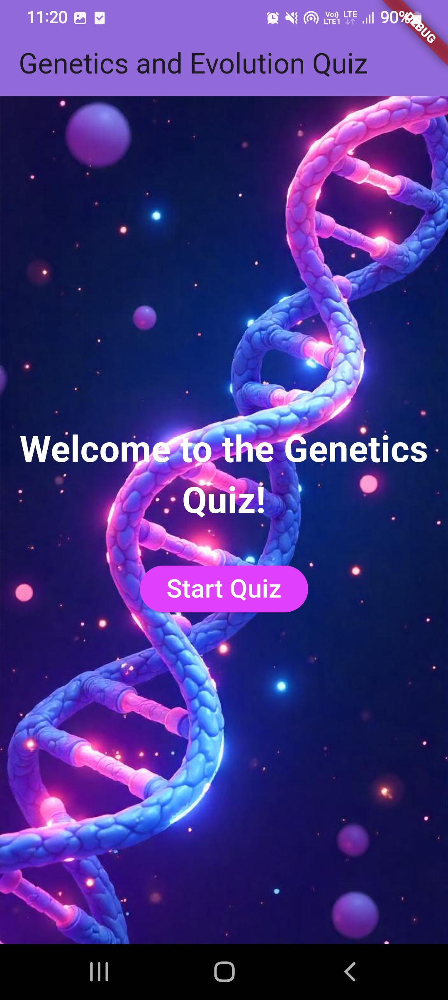
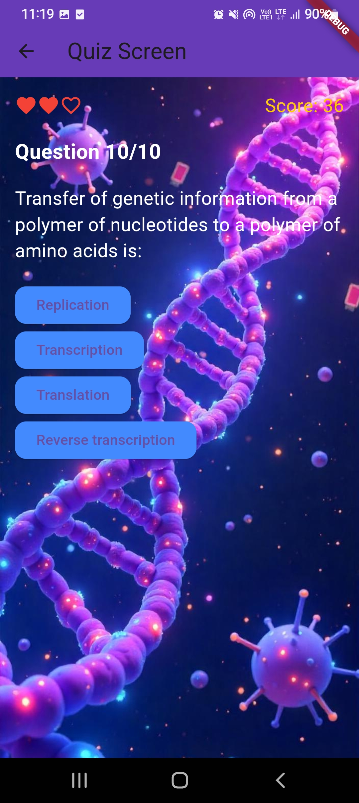
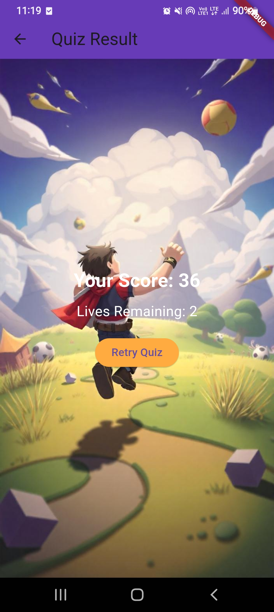
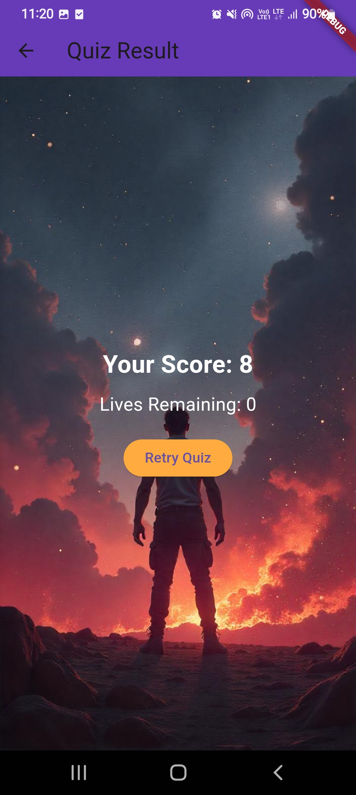

# Genetics and Evolution Quiz App

## Project Overview
The **Genetics and Evolution Quiz App** is a Flutter-based interactive quiz application designed to test users' knowledge of genetics and evolution. The app provides gamification features, including scoring, lives, background sounds, and a visually appealing UI. It fetches quiz data dynamically from an API and offers a seamless experience for users.

## Features
- **Dynamic Quiz Data**: Quiz questions and options are fetched from a remote API.
- **Gamification Elements**:
  - Scores are updated for correct answers.
  - Lives decrease for incorrect answers.
- **Audio Effects**:
  - Background sound on the home and result screens.
  - Correct and incorrect answer sound effects.
- **Background Images**: The app includes themed backgrounds for each screen.
- **Retry Functionality**: Users can retry the quiz after completing it.

## Screenshots
### Home Screen

)

### Quiz Screen

)

### Result Screen (Success)

)

### Result Screen (Game Over)

)

## Video Walkthrough
[Click here to watch the video walkthrough](app_demo.mp4)

---

## Setup Instructions

### Prerequisites
1. Install [Flutter](https://flutter.dev/docs/get-started/install) and ensure it is set up on your system.
2. Install any code editor of your choice (e.g., [Android Studio](https://developer.android.com/studio), [Visual Studio Code](https://code.visualstudio.com/)).

### Steps
1. Clone the repository:
   ```bash
   git clone <repository-link>
   ```

2. Navigate to the project directory:
   ```bash
   cd quiz_app
   ```

3. Install dependencies:
   ```bash
   flutter pub get
   ```

4. Add the required assets:
   - Place the background images in `assets/images/`.
   - Place the audio files in `assets/sounds/`.

5. Run the app:
   ```bash
   flutter run
   ```

### Notes
- The app requires an internet connection to fetch quiz data from the API.
- Ensure your Flutter environment is correctly set up to avoid runtime errors.

---

## API Used
The quiz data is fetched from the following API:
- **Endpoint**: `https://api.jsonserve.com/Uw5CrX`
- **Response Format**:
  ```json
  {
    "questions": [
      {
        "description": "Question text here",
        "options": [
          { "description": "Option 1", "is_correct": true },
          { "description": "Option 2", "is_correct": false }
        ]
      }
    ]
  }
  ```

## Folder Structure
```
quiz_app/
├── lib/
│   ├── main.dart       # Main application file
├── assets/
│   ├── images/         # Background images
│   ├── sounds/         # Audio files
├── screenshots/        # App screenshots
├── videos/             # App demo video
├── pubspec.yaml        # Dependency file
```

---

## Contribution
Contributions are welcome! If you'd like to improve the app, feel free to fork the repository and create a pull request.


